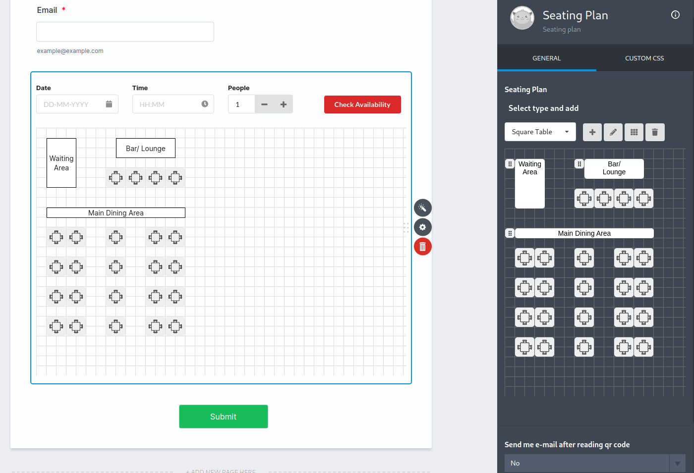
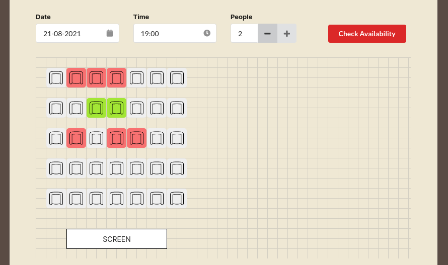
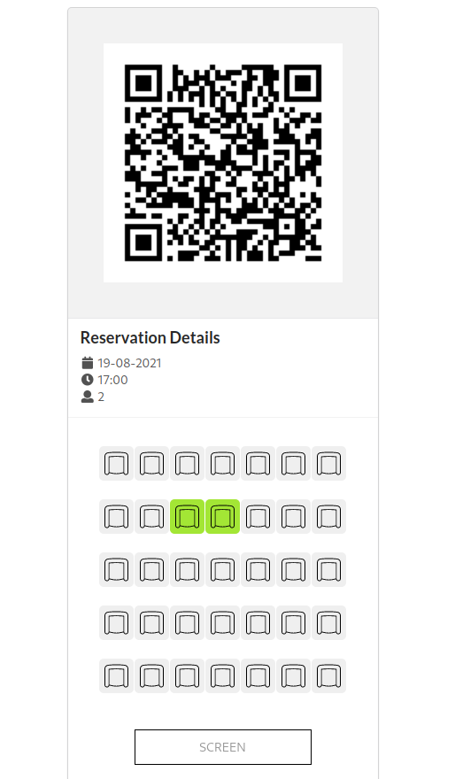
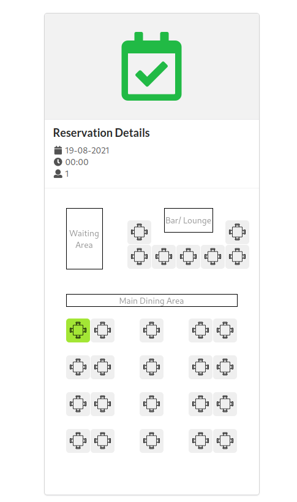

# Seating Plan

Seating Plan allows JotForm users to create a plan for seat-based registration events (like restaurants, theaters, cinemas, bus tours etc.) so that the form users can reserve the seats according to plan. It is developed during internship period in JotForm.

You can create a seating plan on 'Edit Page', and preview on the 'Preview Page'.

- Edit Page: https://jotform-widget.netlify.app/edit
- Preview Page: https://jotform-widget.netlify.app/
- Example Reservation Details: https://jotform-widget.netlify.app/reservation?uid=212303313933040&id=-MhYZdt3Jj1vfsd36ahk

## Use cases on the forms

### [Restaurant Reservation Form](https://form.jotform.com/212303222198042)

### [Cinema Form](https://form.jotform.com/212303313933040)

 

### Reservation Details

	
	

- Restaurant reservation form: 

## Technologies

- This project was bootstrapped with [Create React App](https://github.com/facebook/create-react-app).
- Firebase for anonymous login and storing user data such as seat position, type and reservations.
- [dnd-kit](https://github.com/clauderic/dnd-kit) for draggables on the edit page.
- [Semantic UI React](https://react.semantic-ui.com/) as primary UI kit.
- [JotForm Widget API](https://www.jotform.com/developers/widgets/) for integration with JotForm.

In the project directory, you can run:

### `yarn start`

Runs the app in the development mode.\
Open [http://localhost:3000](http://localhost:3000) to view it in the browser.

The page will reload if you make edits.\
You will also see any lint errors in the console.

### `yarn build`

Builds the app for production to the `build` folder.\
It correctly bundles React in production mode and optimizes the build for the best performance.

The build is minified and the filenames include the hashes.\
Your app is ready to be deployed!

See the section about [deployment](https://facebook.github.io/create-react-app/docs/deployment) for more information.
